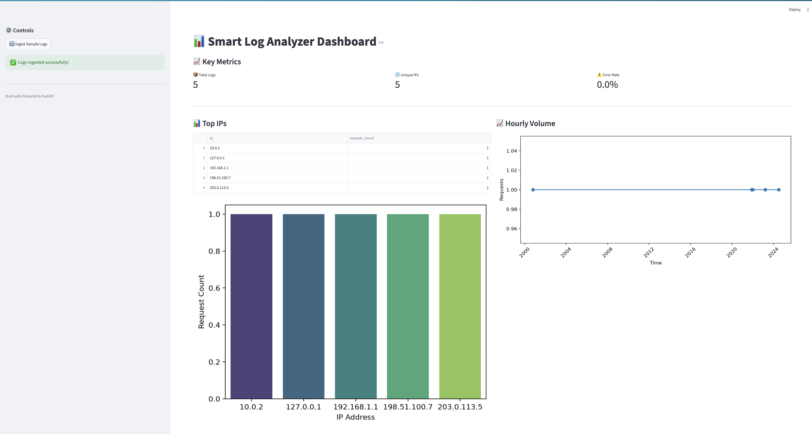

# 🚀 Smart Log Analyzer

> A production-grade log processing pipeline that parses, stores, analyzes, and visualizes Apache-style logs — from raw files to a live cloud API.

[](https://github.com/bernard-omondi/smart-log-analyzer/actions/workflows/ci.yml)
[](https://www.python.org/downloads/release/python-3110/)
[](https://www.docker.com/)
[](https://opensource.org/licenses/MIT)

---

## 📸 Screenshot



---

## 🎯 What It Does

Smart Log Analyzer ingests raw Apache/Nginx log files, extracts structured data (IP, timestamp, method, URL, status, size), stores it in a database with deduplication, and exposes analytical endpoints plus a real-time dashboard.

**The full pipeline:**

```
Raw Logs → Parser → Database → FastAPI → Dashboard
             ↑         ↑         ↑          ↑
          Regex     SQLite   REST API   Streamlit
          +TZ       +Index   +Pydantic  +Charts
```

---

## ✨ Features

- 🔍 **Robust Log Parsing** — Regex-based parsing of Apache combined log format with **full timezone handling** (converts to UTC)
- 💾 **Smart Database** — SQLite with `UNIQUE` constraints, indexes, and `INSERT OR IGNORE` for automatic deduplication
- ⚡ **High-Performance CLI** — `argparse`-driven interface with `--verbose`, `--limit`, and `--query` flags
- 📊 **Analytical Queries** — Top IPs, hourly volume, and error-rate-per-endpoint
- 🌐 **REST API** — FastAPI backend with auto-generated OpenAPI docs
- 🎨 **Interactive Dashboard** — Streamlit UI with metric cards, tables, and charts
- 🐳 **Fully Containerized** — Docker + Dockerfile for reproducible builds
- 🤖 **CI/CD** — GitHub Actions runs tests, linters, and type checks on every push
- ☁️ **Cloud-Ready** — Deployed on Render; kept alive with cron-job.org

---

## 🏗️ Architecture

```
┌─────────────────────────────────────────────────────────────────┐
│                        USER INTERFACES                          │
│  ┌────────────┐  ┌────────────┐  ┌────────────┐                │
│  │ Streamlit  │  │  REST API  │  │    CLI     │                │
│  │ Dashboard  │  │ (FastAPI)  │  │ (argparse) │                │
│  └─────┬──────┘  └─────┬──────┘  └─────┬──────┘                │
│        │               │                │                       │
│        └───────────────┼────────────────┘                       │
│                        │                                        │
│                        ▼                                        │
│  ┌────────────────────────────────────────────┐                │
│  │           src/ingest.py (Orchestrator)     │                │
│  └────────────┬───────────────────┬───────────┘                │
│               │                   │                             │
│               ▼                   ▼                             │
│  ┌────────────────────┐  ┌────────────────────┐                │
│  │   src/parser.py    │  │    src/db.py       │                │
│  │   Regex + TZ       │  │    SQLite + Index  │                │
│  └────────────────────┘  └─────────┬──────────┘                │
│                                    │                            │
│                                    ▼                            │
│                          ┌────────────────────┐                 │
│                          │    logs.db         │                 │
│                          │    (SQLite)        │                 │
│                          └────────────────────┘                 │
└─────────────────────────────────────────────────────────────────┘
```
---

## 🛠️ Tech Stack

| Layer | Technology |
|-------|-----------|
| **Language** | Python 3.11 |
| **Parsing** | `re`, `datetime`, `zoneinfo` |
| **Database** | SQLite |
| **API** | FastAPI + Uvicorn |
| **CLI** | `argparse` |
| **Visualization** | matplotlib, seaborn, pandas |
| **Dashboard** | Streamlit |
| **Container** | Docker |
| **CI/CD** | GitHub Actions |
| **Hosting** | Render |
| **Uptime** | cron-job.org |

---

## 🌐 Live Demo

- **API:** [`https://smart-log-analyzer-gl1x.onrender.com`](https://smart-log-analyzer-gl1x.onrender.com)
- **API Docs:** [`https://smart-log-analyzer-gl1x.onrender.com/docs`](https://smart-log-analyzer-gl1x.onrender.com/docs)

> ⚠️ **Note:** The free Render instance sleeps after 15 minutes of inactivity. The first request may take up to 60 seconds to wake up.

**Try it now:**

```
curl https://smart-log-analyzer-gl1x.onrender.com/
```

## 🚀 Quick Start

Option 1: Run with Docker (Recommended)

```
# 1. Clone the repository
git clone https://github.com/bernard-omondi/smart-log-analyzer.git
cd smart-log-analyzer

# 2. Build the Docker image
docker build -t smart-log-analyzer .

# 3. Run the API
docker run -v $(pwd):/app/data -p 10000:10000 smart-log-analyzer

# 4. In another terminal, ingest sample logs
curl -X POST http://localhost:10000/ingest \
  -H "Content-Type: application/json" \
  -d '{"filepath": "/app/data/sample.log"}'

# 5. Query the API
curl http://localhost:10000/top-ips
```
Option 2: Run Locally with Python

```
# 1. Clone and enter the project
git clone https://github.com/bernard-omondi/smart-log-analyzer.git
cd smart-log-analyzer

# 2. Create a virtual environment
python -m venv venv
source venv/bin/activate   # On Windows: venv\Scripts\activate

# 3. Install the package
pip install -e ".[dev]"

# 4. Ingest logs via CLI
python -m src.ingest sample.log --verbose

# 5. Start the API
uvicorn src.api:app --reload

# 6. In another terminal, start the dashboard
streamlit run src/dashboard.py
```

Then visit:

    API: http://localhost:8000

    Dashboard: http://localhost:8501


## 📁 Project Structure

```
smart-log-analyzer/
├── src/
│   ├── parser.py         # Log parsing with timezone handling
│   ├── db.py             # SQLite schema, indexes, queries
│   ├── ingest.py         # CLI orchestrator
│   ├── api.py            # FastAPI endpoints
│   ├── dashboard.py      # Streamlit UI
│   └── visualize.py      # Matplotlib/seaborn charts
├── tests/
│   └── test_parser.py    # Unit tests for the parser
├── scripts/
│   └── generate_logs.py  # Synthetic log generator
├── docs/
│   ├── design.md
│   └── session-*-summary.md
├── screenshots/
│   ├── dashboard.png
│   ├── api_response.png
│   └── render_deploy.png
├── Dockerfile
├── pyproject.toml
├── README.md
└── .gitignore
```


## 🧪 Running Tests

```
# Run unit tests
pytest tests/ -v

# Run with coverage
pytest tests/ --cov=src
```

## 📚 Documentation

Detailed development notes are in the docs/ directory:

    docs/design.md — Design decisions

    docs/session-*-summary.md — Step-by-step build journal

## 📄 License

This project is licensed under the MIT License.

## 👤 Author

Bernard Omondi

    GitHub: @bernard-omondi

## 🙏 Acknowledgements

Built as a deep-dive into production-grade Python engineering — from raw log files to a cloud-deployed, fully-tested, containerized application.
